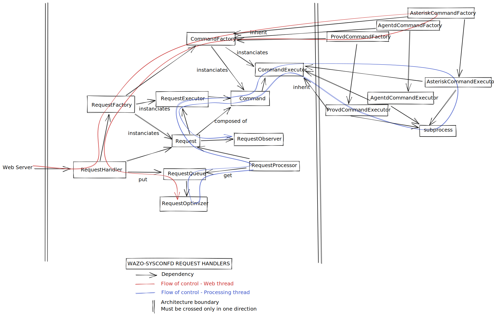

# wazo-sysconfd

[](https://jenkins.wazo.community/job/wazo-sysconfd)

wazo-sysconfd is a daemon for configuring system parameters on a Wazo server

## Running unit tests

```shell
tox --recreate -e py37
```

## Running integration tests

```shell
tox --recreate -e integration
```

## Development

### Request handlers architecture


[Architecture diagram source](https://excalidraw.com/#json=5720016209051648,87-AW9gy4HNCa4M0pwUi6w)
